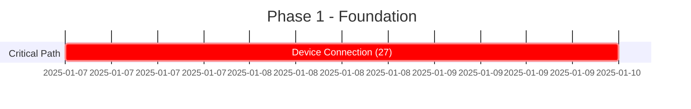
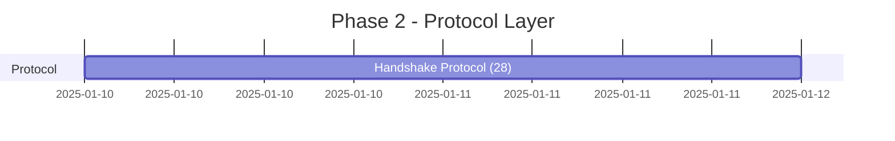
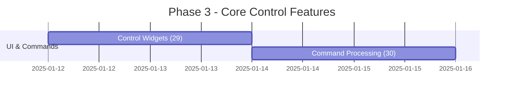
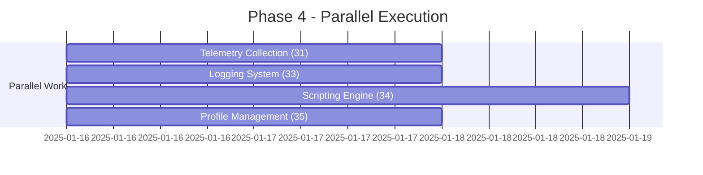
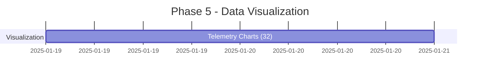
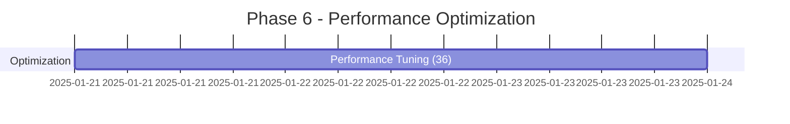

# 🚀 Multi-Controller App - Parallel Execution Dashboard

## 📊 Overall Progress
- **Total Tasks**: 10 main tasks, 50 subtasks
- **Status**: Ready to execute
- **Estimated Timeline**: 12-15 days (parallelized from 30+ days)
- **Specialized Agents**: 10 domain experts assigned

## 🎯 Execution Phases

### Phase 1: Foundation (Days 1-3)

- **Agent**: serial-comm-specialist
- **Focus**: SerialTransport, ArduinoDriver, Session Management
- **Dependencies**: None (can start immediately)

### Phase 2: Protocol (Days 4-5)

- **Agent**: handshake-protocol-engineer
- **Focus**: JSON handshake, 5-second timeout, firmware validation
- **Dependencies**: Task 27 complete

### Phase 3: Core Features (Days 6-9)

- **Agents**: ui-controls-architect, command-processor
- **Focus**: Manual controls, command queue, transmission
- **Dependencies**: Task 28 complete

### Phase 4: Parallel Features (Days 10-12) 🔥

**🎯 MAXIMUM PARALLELIZATION OPPORTUNITY**
- **Agents**: telemetry-collector, logging-integrator, scripting-architect, profile-manager
- **Strategy**: Deploy 4 agents simultaneously
- **Focus**: Independent feature development
- **Dependencies**: Task 30 complete

### Phase 5: Visualization (Days 13-14)

- **Agent**: visualization-engineer
- **Focus**: egui_plot charts, 30 FPS rendering, data decimation
- **Dependencies**: Task 31 complete

### Phase 6: Optimization (Days 15-17)

- **Agent**: performance-optimizer
- **Focus**: CPU monitoring, memory optimization, UI responsiveness
- **Dependencies**: Tasks 32, 33, 34, 35 complete

## 📈 Agent Deployment Strategy

### Immediate Deployment (Day 1)
- ✅ **serial-comm-specialist** → Task 27

### Sequential Deployments
- Day 4: **handshake-protocol-engineer** → Task 28
- Day 6: **ui-controls-architect** → Task 29
- Day 8: **command-processor** → Task 30

### Parallel Deployment Burst (Day 10) 🚀
- **telemetry-collector** → Task 31
- **logging-integrator** → Task 33
- **scripting-architect** → Task 34
- **profile-manager** → Task 35

### Final Deployments
- Day 13: **visualization-engineer** → Task 32
- Day 15: **performance-optimizer** → Task 36

## 🎯 Critical Path Analysis

**Critical Path**: 27 → 28 → 29 → 30 → 31 → 32 → 36
- Total Critical Path Length: 17 days
- Parallel Optimization Savings: 15+ days

## ✅ Quality Gates Per Phase

### Phase 1 Quality Gates
- [ ] SerialTransport tests pass
- [ ] Cross-platform validation
- [ ] Memory leak detection clean

### Phase 2 Quality Gates
- [ ] 5-second timeout verified
- [ ] Version negotiation tested
- [ ] Error scenarios covered

### Phase 3 Quality Gates
- [ ] UI response <16ms
- [ ] Command queue thread-safe
- [ ] Retry logic functional

### Phase 4 Quality Gates
- [ ] Ring buffers stable at 2000+ samples
- [ ] Log rotation working
- [ ] Scripts sandboxed properly
- [ ] Profiles hot-reload functional

### Phase 5 Quality Gates
- [ ] Charts render at 30 FPS
- [ ] Data decimation accurate
- [ ] Export formats valid

### Phase 6 Quality Gates
- [ ] CPU <2% idle
- [ ] Memory <150MB
- [ ] Startup <2 seconds
- [ ] 60 FPS UI maintained

## 🔄 Sync Points

### Daily Sync Requirements
1. Morning: Agent status check
2. Midday: Progress update to TaskMaster
3. Evening: Quality gate verification

### Phase Transition Checkpoints
- Verify all phase tasks complete
- Run integration tests
- Update TaskMaster statuses
- Deploy next phase agents

## 📊 Risk Mitigation

### High Risk Areas
1. **Serial Communication** (Task 27) - Platform differences
2. **Performance Targets** (Task 36) - Aggressive thresholds
3. **Parallel Execution** (Phase 4) - Resource contention

### Mitigation Strategies
- Early platform testing
- Incremental performance optimization
- Resource monitoring during parallel execution
- Fallback to sequential if issues arise

## 🎉 Success Metrics

### Time Savings
- **Original Estimate**: 30+ days sequential
- **Optimized Estimate**: 12-15 days parallel
- **Efficiency Gain**: 50-60%

### Quality Metrics
- Zero-defect philosophy maintained
- All quality gates must pass
- Comprehensive test coverage
- Performance targets met

## 🚦 Execution Commands

### Start Phase 1
```bash
# Deploy serial-comm-specialist
claude --agent serial-comm-specialist
task-master set-status --id=27 --status=in-progress
```

### Monitor Progress
```bash
# Check overall status
task-master list --status=in-progress

# View specific task
task-master show 27

# Check agent logs
tail -f .claude/epics/device-connection/agent.log
```

### Phase Transition
```bash
# Complete current phase
task-master set-status --id=27 --status=done

# Start next phase
task-master next
```

---

**Ready to Execute!** 🚀 All agents assigned, dependencies mapped, and parallel execution optimized.