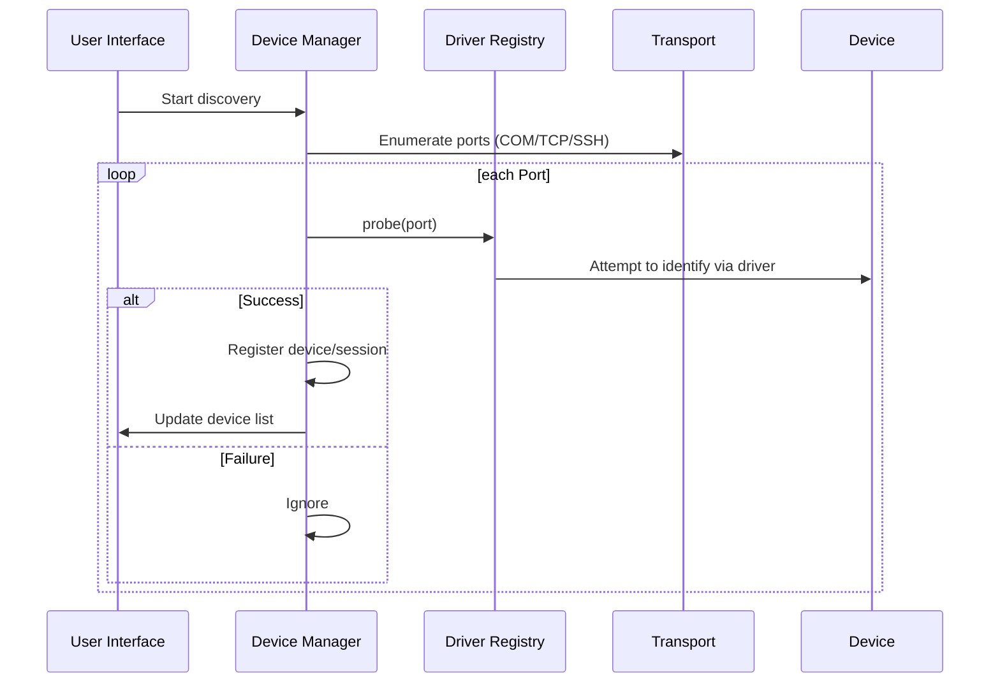
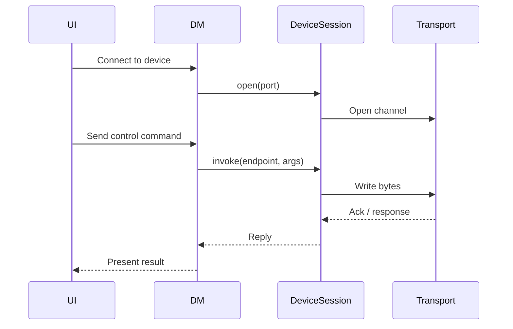
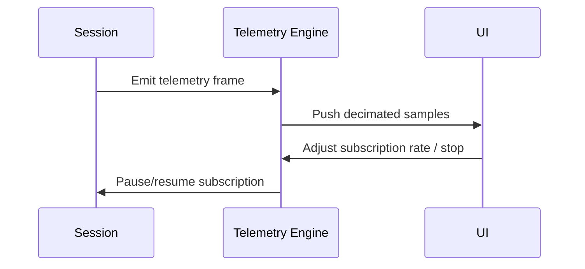

# Architecture Overview

This document describes the high‑level architecture of the Windows Multi‑Controller App. The application is composed of a small set of modular components that work together to discover devices, manage connections, provide user controls, execute scripts, and display telemetry. The design emphasises low resource usage, asynchronous operations and extensibility via plug‑in drivers.

## Module Map

| Module               | Responsibility                                                                                                                                                                                                                                           |
| -------------------- | -------------------------------------------------------------------------------------------------------------------------------------------------------------------------------------------------------------------------------------------------------- |
| **UI Layer**         | Implements the single‑window user interface (WPF/WinUI or Rust UI) with tabs for Devices, Manual Controls, Scripts, Telemetry, Logs and Profiles. It interacts with the core through a message bus and presents a responsive, keyboard‑first experience. |
| **Device Manager**   | Orchestrates discovery, connection and lifecycle of devices. It enumerates available ports (COM/TCP/SSH), probes them via registered drivers and maintains a registry of active sessions.                                                                |
| **Driver Registry**  | Loads plug‑in drivers from `/drivers` and exposes them via the `IDeviceDriver` interface. Each driver declares supported transports and implements probing, opening, reading/writing, subscription and shutdown.                                         |
| **Transport Layer**  | Provides unified asynchronous I/O over serial (COM), TCP/UDP and SSH. Transports handle reconnection with exponential backoff and jitter, and abstract away low‑level details such as baud rate configuration.                                           |
| **Scripting Engine** | Hosts the chosen scripting runtime (JavaScript, Lua or Python). It provides a sandboxed API to list devices, send commands and subscribe to telemetry. Scripts run in their own context to prevent blocking the UI.                                      |
| **Telemetry Engine** | Receives telemetry frames from device sessions, applies decimation and buffering, and forwards samples to the UI. Uses a bounded ring buffer per stream to avoid unbounded memory growth.                                                                |
| **Profile Manager**  | Loads and saves named setups (e.g., lists of devices, transport settings, control mappings) in human‑readable JSON or TOML. Supports hot‑reload and validation against a schema.                                                                         |
| **Logger**           | Centralises application and device I/O logging. Maintains rolling files, exposes logs through the UI and supports one‑click export.                                                                                                                      |

### Directory Mapping

- `/app/` – Contains the UI code (WPF/WinUI XAML or Rust UI) and the core classes (device manager, scripting engine, telemetry engine, logger).
- `/drivers/` – Each subdirectory contains a device driver implementation and a `manifest.json` describing its capabilities and supported transports. Drivers implement the `IDeviceDriver` and `IDeviceSession` interfaces.
- `/transports/` – Houses implementations for serial, TCP/UDP and SSH communication. Each transport exposes async open/read/write APIs and reconnection logic.
- `/scripts/` – Bundled sample scripts demonstrating manual ramp control, telemetry recording and multi‑device choreography.
- `/profiles/` – Example profiles that map multiple RioRand controllers to keyboard inputs.

## Data & Control Flow

### Discovery Sequence

### Connection & Control

### Telemetry Subscription

## Architectural Considerations

### Programming Language & UI Framework

The project initially evaluates two options: **C# with WPF/WinUI 3 compiled using Native AOT** and **Rust with a minimal Win32 or Rust GUI library**. .NET Native AOT offers reduced disk footprint, start‑up time and memory consumption by trimming unused runtime code【864974145225502†L124-L142】, but not all features (e.g., Reflection heavy libraries) are compatible【864974145225502†L156-L182】. Rust provides memory safety and high performance without a garbage collector【155744810364120†L12-L16】, avoiding unpredictable GC overhead【155744810364120†L117-L122】. A minimal proof‑of‑concept will be built for both stacks to measure actual start‑up time and memory usage before committing to one.

### Asynchronous Design

All I/O operations (serial reads/writes, network sockets, SSH channels) are performed asynchronously to prevent blocking the UI. Each device session runs in its own task with cancelation tokens for clean shutdown. A message bus (e.g., thread‑safe channel) propagates state changes and telemetry to the UI.

### Configuration & Profiles

Configuration files (JSON/TOML) are schema‑validated to prevent malformed profiles from causing runtime errors. The profile loader supports hot‑reload, and users can save new profiles via the UI. Sensitive fields (such as SSH keys) are stored separately and never logged.

### Safety Mechanisms

- **Global stop**: Immediately neutralises all control outputs by sending zero‑value commands to all active device sessions.
- **Rate limiting & clamping**: Drivers enforce maximum/minimum values and rate limits on analog/PWM outputs to prevent damage.
- **Hot‑plug recovery**: When a device disconnects unexpectedly, its session is terminated and removed. The UI is updated and reconnection attempts commence automatically.

## Future Enhancements

The modular design allows for future additions such as BLE/Wi‑Fi discovery, a richer script editor, remote telemetry dashboards and support for other scripting languages. These extensions should integrate cleanly by implementing new drivers or transports without modifying the core.
