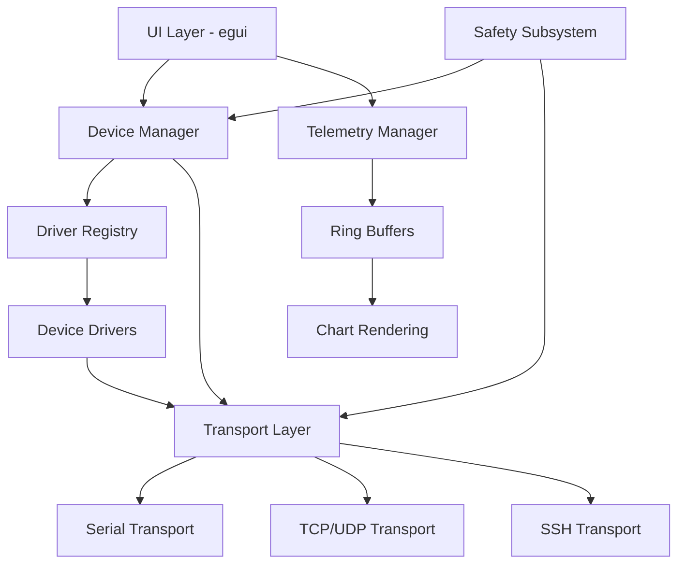

# Multi-Controller App - Architecture Reference

**Last Updated**: 2025-08-25  
**Architecture Version**: 2.0  
**Technology Stack**: Rust + egui (decided 2025-08-25)

## System Architecture Overview

The Multi-Controller App follows a layered architecture with clear separation of concerns, designed for extensibility, performance, and maintainability. The architecture emphasizes sub-second startup times, minimal resource usage, and safe concurrent hardware control.

## Core Components

### 1. UI Layer
- **Technology**: egui (immediate mode GUI in Rust)
- **Rendering**: wgpu backend for GPU acceleration
- **Features**:
  - Devices tab: Discovery and connection management
  - Manual Controls tab: Direct device interaction
  - Scripts tab: Automation script management
  - Telemetry tab: Real-time data visualization
  - Logs tab: System and device logging
  - Profiles tab: Configuration management

### 2. Device Manager
Central orchestrator for device lifecycle management:
- Device discovery (serial port enumeration, network scanning)
- Connection management with health monitoring
- Session lifecycle (create, maintain, destroy)
- Event aggregation and distribution

### 3. Driver Registry
Plugin-based driver system:
- Dynamic driver loading from `/drivers` directory
- Driver manifest validation
- Capability negotiation
- Version compatibility checking

### 4. Transport Layer
Asynchronous communication abstraction:
- **Serial**: COM port communication with hardware flow control
- **TCP/UDP**: Network socket management
- **SSH**: Secure shell for Raspberry Pi control
- Features:
  - Automatic reconnection with exponential backoff
  - Connection pooling
  - Latency enforcement (50ms serial, 100ms network)
  - Error recovery and retry logic

### 5. Telemetry System
High-performance data streaming:
- Ring buffer implementation (10K samples default)
- Decimation algorithms for UI responsiveness
- Real-time charting with double buffering
- Memory-efficient data pruning

### 6. Safety Subsystem
Hardware protection mechanisms:
- Global emergency stop (red button)
- Rate limiting on all outputs
- Bounded PWM/actuation values
- Ramp rate enforcement
- Watchdog timers

## Interface Definitions

### IDeviceDriver Interface
```rust
// Rust interface definition (trait)
pub trait DeviceDriver: Send + Sync {
    fn name(&self) -> &str;
    fn supported_transports(&self) -> &[TransportType];
    async fn probe(&self, transport: &dyn Transport) -> Result<bool, Error>;
    async fn open(&self, transport: Box<dyn Transport>) -> Result<Box<dyn DeviceSession>, Error>;
}
```

**C# Equivalent (for reference)**:
```csharp
interface IDeviceDriver {
    string Name { get; }
    string[] SupportedTransports { get; }
    Task<bool> ProbeAsync(ITransport transport);
    Task<IDeviceSession> OpenAsync(ITransport transport);
}
```

### IDeviceSession Interface
```rust
// Rust interface definition (trait)
pub trait DeviceSession: Send + Sync {
    async fn invoke(&mut self, endpoint: &str, args: &[Value]) -> Result<Value, Error>;
    async fn subscribe(&mut self, stream: &str, handler: Box<dyn Fn(&[u8]) + Send>) -> Result<SubscriptionHandle, Error>;
    async fn close(&mut self) -> Result<(), Error>;
}
```

**C# Equivalent (for reference)**:
```csharp
interface IDeviceSession {
    Task<object> InvokeAsync(string endpoint, object[] args);
    Task<IDisposable> SubscribeAsync(string stream, Action<byte[]> handler);
    Task CloseAsync();
}
```

### ITransport Interface
```rust
// Rust interface definition (trait)
pub trait Transport: Send + Sync {
    fn transport_type(&self) -> TransportType;
    fn is_connected(&self) -> bool;
    async fn connect(&mut self, params: ConnectionParams) -> Result<(), Error>;
    async fn send_receive(&mut self, data: &[u8], timeout: Duration) -> Result<Vec<u8>, Error>;
    async fn disconnect(&mut self) -> Result<(), Error>;
    fn subscribe_state_changes(&mut self, handler: Box<dyn Fn(ConnectionState) + Send>);
}
```

**C# Equivalent (for reference)**:
```csharp
interface ITransport {
    TransportType Type { get; }
    bool IsConnected { get; }
    Task ConnectAsync(ConnectionParams params);
    Task<byte[]> SendReceiveAsync(byte[] data, TimeSpan timeout);
    Task DisconnectAsync();
    event EventHandler<ConnectionStateChangedArgs> ConnectionStateChanged;
}
```

## Data Flow

1. **Device Discovery**:
   - Transport layer scans for available connections
   - Driver registry tests each transport with ProbeAsync
   - Successful probes register devices with Device Manager

2. **Command Execution**:
   - UI → Device Manager → Driver → Transport → Hardware
   - Response flows back through same chain
   - All async with cancellation support

3. **Telemetry Streaming**:
   - Hardware → Transport → Driver → Ring Buffer
   - Decimation → UI Chart Component
   - Parallel storage to time-series database

## Security Architecture

- **Authentication**: Device-specific auth mechanisms
- **Authorization**: Role-based access control for operations
- **Encryption**: SSH for network transports, optional TLS for TCP
- **Audit**: All commands logged with timestamps and user context
- **Secrets Management**: Environment variables, never in code/config

## Performance Architecture

### Memory Management
- Fixed-size ring buffers for telemetry (10K samples)
- Zero-copy message passing where possible
- Arena allocators for hot paths
- RAII (Resource Acquisition Is Initialization) for automatic cleanup
- No garbage collection overhead (Rust ownership model)
- Verified memory safety at compile time

### Threading Model
- UI thread for rendering only (egui main loop)
- Tokio async runtime for I/O operations
- Dedicated threads per transport connection
- Message passing via channels (mpsc)
- Lock-free data structures where applicable
- Work-stealing scheduler for CPU-bound tasks

### Optimization Strategies
- Rust release builds with LTO (Link Time Optimization)
- Profile-guided optimization (PGO) for hot paths
- Lazy loading of drivers via dynamic libraries
- Caching of device capabilities in memory-mapped files
- Immediate mode GUI (egui) for minimal state overhead
- SIMD instructions for telemetry decimation
- Measured performance: 231ms startup, 68MB RAM, 0% idle CPU

## Deployment Architecture

### Single-File Distribution
- Single 4MB Rust executable (vs 62MB C# bundle)
- Static linking of all dependencies
- Embedded resources via include_bytes!()
- No runtime dependencies (fully self-contained)
- Code signing for Windows SmartScreen
- Portable - runs from any location

### Configuration
- JSON/TOML profiles in `/profiles`
- Hot-reload capability
- Environment-specific overrides
- Secure credential storage

## Monitoring & Observability

### Metrics (Prometheus)
- Performance counters
- Device statistics
- Error rates
- Resource utilization

### Logging (Structured)
- Application logs
- Device communication traces
- Performance logs
- Security audit logs

### Tracing (OpenTelemetry)
- Distributed trace context
- Command execution spans
- Cross-component correlation

### Health Checks
- Transport connectivity
- Driver availability
- Memory/CPU thresholds
- Device responsiveness

## Testing Architecture

### Unit Tests
- Driver logic validation
- Transport protocol tests
- Safety subsystem verification

### Integration Tests
- End-to-end command flow
- Multi-device scenarios
- Error recovery paths

### Performance Tests
- Startup time measurement
- Memory leak detection
- Throughput benchmarks
- Latency verification

### Hardware-in-the-Loop
- Real device testing
- Loopback verification
- Stress testing (8-hour soak)

## Extension Points

1. **Custom Drivers**: Implement DeviceDriver trait
2. **New Transports**: Implement Transport trait
3. **Script Engines**: Plugin scripting languages (JS/Lua/Python)
4. **UI Themes**: Customizable egui themes
5. **Export Formats**: Data export plugins (CSV/JSON/Parquet)
6. **Alert Handlers**: Custom notification systems

## Architectural Decisions

### Technology Stack (2025-08-25)
**Decision**: Rust + egui over C# Native AOT  
**Rationale**:
- 3x faster startup (231ms vs 699ms)
- 14x smaller distribution (4MB vs 62MB)
- Better memory efficiency (68MB vs 78MB)
- Zero-cost abstractions
- Memory safety without GC

### Async Runtime
**Decision**: Tokio for async I/O  
**Rationale**:
- Mature ecosystem
- Excellent performance
- Built-in timers and channels
- Compatible with async-std if needed

### GUI Framework
**Decision**: egui immediate mode GUI  
**Rationale**:
- Minimal state management
- GPU-accelerated rendering
- Cross-platform potential
- Active development

### Transport Implementation
**Decision**: Async traits with dynamic dispatch  
**Rationale**:
- Plugin architecture support
- Runtime driver loading
- Consistent interface across transports

## Component Dependencies



## Error Handling Strategy

### Error Types
```rust
pub enum AppError {
    Transport(TransportError),
    Driver(DriverError),
    Timeout(Duration),
    Safety(SafetyViolation),
    Configuration(ConfigError),
}
```

### Recovery Strategies
1. **Transport Errors**: Exponential backoff retry
2. **Driver Errors**: Graceful degradation
3. **Timeout**: User notification with retry option
4. **Safety**: Immediate halt with logging
5. **Configuration**: Fallback to defaults

## Concurrency Model

### Message Passing Architecture
```rust
// Actor-like pattern for device management
pub enum DeviceCommand {
    Connect(DeviceId, ConnectionParams),
    SendCommand(DeviceId, Command),
    Subscribe(DeviceId, Stream),
    Disconnect(DeviceId),
}

// Channels for communication
let (tx, rx) = mpsc::channel::<DeviceCommand>(100);
```

### Synchronization Primitives
- `Arc<Mutex<T>>` for shared state
- `RwLock` for read-heavy workloads
- `AtomicBool` for flags
- Channels for message passing
- No raw threading primitives

## Performance Monitoring

### Key Metrics
| Metric | Target | Current | Monitoring |
|--------|--------|---------|------------|
| Startup Time | <2s | 231ms | Stopwatch in main() |
| Memory Usage | ≤150MB | 68MB | Process monitor |
| CPU Idle | ≤2% | 0% | Performance counters |
| Frame Time | <16ms | ~8ms | egui profiler |
| Command Latency | <50ms | TBD | Transport telemetry |

### Profiling Tools
- `cargo-flamegraph` for CPU profiling
- `valgrind` for memory analysis
- `tracy` for real-time profiling
- Built-in metrics via Prometheus

## Security Considerations

### Threat Model
1. **Malicious Drivers**: Sandboxed execution
2. **Network Attacks**: TLS/SSH encryption
3. **Command Injection**: Input validation
4. **Memory Corruption**: Rust safety guarantees
5. **Supply Chain**: Dependency auditing

### Security Controls
- Capability-based permissions
- Signed driver manifests
- Encrypted credential storage
- Audit logging of all commands
- Rate limiting on all inputs

## Migration Path from C# Prototype

### Phase 1: Core Infrastructure (Current)
- [x] Rust project setup
- [x] Basic egui window
- [ ] Transport trait definitions
- [ ] Driver trait definitions

### Phase 2: Feature Parity
- [ ] Port serial transport
- [ ] Port TCP/UDP transport
- [ ] Port device manager
- [ ] Implement UI tabs

### Phase 3: Enhancement
- [ ] Performance optimization
- [ ] Additional drivers
- [ ] Scripting integration
- [ ] Production hardening

## Deployment Scenarios

### Standalone Desktop
- Single executable distribution
- No installation required
- Portable configuration

### Embedded System
- Cross-compilation for ARM
- Headless operation mode
- REST API for remote control

### Cloud Integration
- Telemetry export to cloud
- Remote device management
- Multi-site coordination

---
*Architecture subject to refinement as implementation progresses*